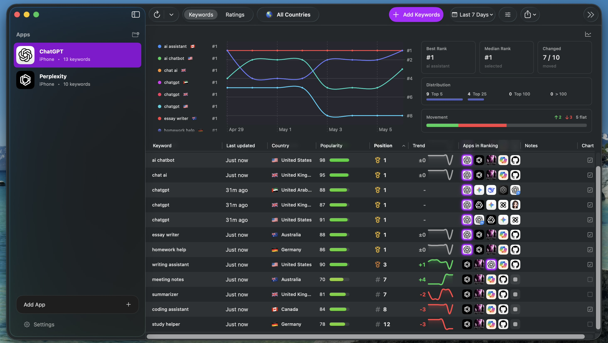

# OpenASO

OpenASO is a native macOS app for App Store Optimization research. It helps track App Store keyword rankings, storefront ratings and reviews, competitor visibility, and Apple Ads keyword popularity for the apps you monitor.



## What OpenASO Does

- Track App Store apps by storefront, App Store ID, bundle ID, title, seller, and platform.
- Create keyword tracks across countries and record ranking snapshots over time.
- Inspect ranked competitor apps returned for each keyword search.
- Monitor storefront ratings, rating history, and reviews.
- Import keyword lists and export keyword, keyword history, and rating data as CSV.
- Run manual refreshes or configure an automatic daily refresh for stale ranking data.

## Documentation

The hosted docs are the canonical guide for using OpenASO:

- [Quickstart](https://openaso.thirdtechapps.com/docs/getting-started/quickstart/)
- [Core concepts](https://openaso.thirdtechapps.com/docs/getting-started/concepts/)
- [Manage apps](https://openaso.thirdtechapps.com/docs/guides/manage-apps/)
- [Track keywords](https://openaso.thirdtechapps.com/docs/guides/track-keywords/)
- [Ratings and reviews](https://openaso.thirdtechapps.com/docs/guides/ratings-reviews/)
- [Apple Ads](https://openaso.thirdtechapps.com/docs/guides/apple-ads/)
- [Import and export](https://openaso.thirdtechapps.com/docs/guides/import-export/)
- [Daily refresh](https://openaso.thirdtechapps.com/docs/guides/daily-refresh/)
- [CSV formats](https://openaso.thirdtechapps.com/docs/reference/csv-formats/)
- [Common issues](https://openaso.thirdtechapps.com/docs/troubleshooting/common-issues/)

## Requirements

- macOS 15.0 or later
- Xcode 17 or later with Swift 6.2 support
- Node.js for the optional Apple Ads web session helper
- Apple Ads and App Store Connect credentials for private account-backed features

## Setup

1. Clone the repository.
2. Open `OpenASO.xcodeproj` in Xcode, or build from the command line.
3. Use `.env.example` as a reference if you want to export Apple Ads API credentials as process environment variables.
4. Enter Apple Ads web login credentials and App Store Connect credentials in the app Settings window when needed.

Analytics is off by default for checked-in OSS builds. Non-OSS builds that omit `OPENASO_OSS_BUILD` keep analytics enabled by default.

## Data And Credentials

OpenASO stores app, keyword, rating, review, and metric data locally with SwiftData. CSV export is the primary path for using that data outside the app, especially for AI-assisted review analysis, keyword research, reporting, or spreadsheets.

## Build And Test

Build and run:

```sh
./script/build_and_run.sh
```

Run tests:

```sh
xcodebuild test -project OpenASO.xcodeproj -scheme OpenASO -destination 'platform=macOS,arch=arm64' -derivedDataPath Build CODE_SIGNING_ALLOWED=NO
```

Launch smoke check:

```sh
./script/build_and_run.sh --verify
```

## Apple Service Notes

OpenASO relies on public App Store endpoints, Apple Ads APIs, App Store Connect APIs, and an optional browser-backed Apple Ads session helper. These services may rate-limit, redirect, require two-factor authentication, or change response formats. The app reports provider errors where possible, but some features require valid account access and current Apple service behavior.

## License

OpenASO is available under the MIT License. See `LICENSE`.
